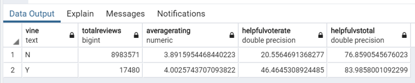

# BigData
Module 16 of UofT Data Analytics Boot Camp

## Overview
The objectives of the module are;
* Perform ETL of Amazon customer review datasets between Amazon Web Service (AWS) and PostgreSQL.
* Analyze the trends of reviews by vine (paid) user and non-vine (free) user.

## Resources
* Software / Services: AWS, Google Colab Notebook, pgAdmin 4, Jupyter Lab
* Programming Language: PySpark, Python, PostgreSQL
* Data Source: https://s3.amazonaws.com/amazon-reviews-pds/tsv/amazon_reviews_us_Wireless_v1_00.tsv.gz

## ETL
Amazon customer review datasets was successfully stored on an AWS RDS database as shown below.


Please visit the link below to Google Colab notebook for the ETL process.

URL: https://colab.research.google.com/drive/1h_GXQ2cuYdghokgqolOTnLIuJ8YcddMp?usp=sharing


## Analysis of Vine Review
PostgreSQL was used to calculate the various metrics related the product reviews.

```SQL
SELECT vine, 
	COUNT(*) AS TotalReviews, 
	AVG(star_rating) AS AverageRating,
	CAST(SUM(CASE WHEN helpful_votes > 0 THEN 1 ELSE 0 END) AS float)/CAST(COUNT(*) AS float)*100 AS HelpfulVoteRate,
	CAST(SUM(helpful_votes) AS float)/CAST(SUM(total_votes) AS float)*100 AS HelpfulvsTotal

FROM public.vine_table v
LEFT JOIN public.review_id_table r ON v.review_id = r.review_id
GROUP BY vine
```

The result is shown in the table below.


Some findings are;
* The reviews by vine user acount for less than 1% of total reviews.
* The average rate of vine user is 4.0 which is slightly higher than that of non-vine user with only difference of 0.1.
* Almost half of the reviews by the vine user received at least one helpful vote, while only approx. 20% of reviews by the free user received one of more helpful vote.

Hence, the reviews by the vine is not biased towards high rate compared to the reviews by free user and even more, their reviews are likely more valuable to other users compared to the reviews provided by free users.